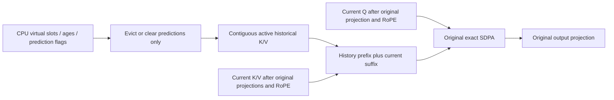
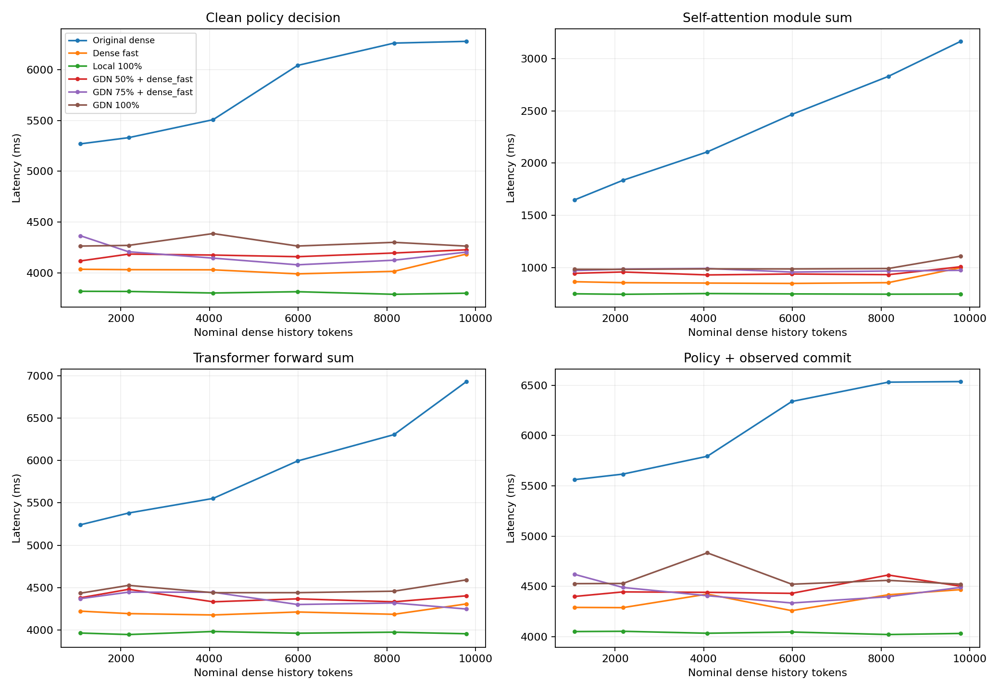
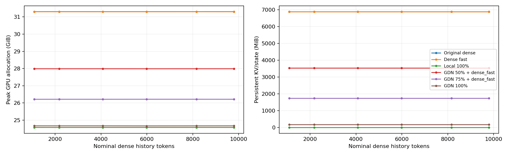

# Exact dense-cache optimization and RoboTwin GDN comparison

Branch: `gdn`. Starting commit: `106d82375dc25f53525f9571fa77155fe9efcbb9`.

**Result:** `dense_fast` improves original-dense policy latency by 1.50–1.56× at 8–10k tokens. GDN-50/75/100 provide no meaningful policy speedup over `dense_fast`: **STOP the GDN speed direction** for this configuration. GDN-100 still reduces peak GPU allocation by 6.63 GiB. This phase performs no training, distillation, simulator rollout, or success-rate evaluation.

## Exact dense-fast implementation

`wan_va/modules/dense_cache.py` stores active K/V contiguously in preallocated `[B, capacity, H, D]` buffers. A Python length identifies the active prefix; current tokens are written into its spare suffix. Ordinary `update_cache=0` calls do not mutate history metadata or move historical K/V. They require no CUDA `nonzero`, mask scalar reads, argsort or history gather. Q/K/V projections, RMSNorm, RoPE, SDPA and output projections remain unchanged.

CPU metadata preserves the original virtual slot numbers, chunk IDs and prediction flags. Accepted chunks append; prediction removal or eviction compacts surviving K/V only at structural changes. A returned insertion handle contains precisely its virtual slots, so explicit non-LIFO rollback removes those slots alone. Episode reset releases the cache; independent cache names remain independent.

Two non-obvious original behaviors are preserved:

1. Temporary noisy insertion can evict old tokens permanently. Rollback removes the temporary entries but **does not resurrect evicted history**.
2. FIFO IDs are per chunk, and the original `torch.argsort` is unstable within equal-age chunks. Partial eviction can therefore remove a nonchronological subset within the oldest chunk. Changing to stable FIFO would change outputs. The optimized cache uses a bounded shared CPU metadata-plan cache; on a previously unseen eviction pattern it calls the original device argsort and copies that small plan to CPU. All layers with the same metadata reuse it. This is a cold-path sort/synchronization, not a claim to eliminate every sort forever. Warmup samples retain the cost in their raw records; repeated steady-state measurements use warmed plans.

Contiguous K/V may present surviving tokens in a different order than the original physical slot gather. Softmax is permutation-invariant mathematically; floating-point reductions may differ. Tests compare outputs within explicit tolerances and check the retained token sets exactly. No attention approximation is introduced by `dense_fast`.



## Configurations and denominator

- Original dense: unchanged implementation, reference only.
- Dense fast: all 30 layers use `dense_fast`.
- Local 100%: all layers retain exact current-chunk attention and discard history.
- GDN 50%: 15 uniformly spaced GDN layers; the remaining 15 use `dense_fast`.
- GDN 75%: 23 uniformly spaced GDN layers (76.7%); the remaining 7 use `dense_fast`.
- GDN 100%: 30 GDN layers, each retaining exact current-chunk softmax.

GDN parameters are the initial unadapted per-head gates. No adapter from the LIBERO alignment experiment is loaded. Its committed/speculative state semantics and low-level FLA implementation remain unchanged. The benchmark and analyzer reject mixed configurations that would silently substitute original dense for the remaining GDN layers.

All headline speedups are **dense_fast time / variant time**. Original-dense improvements are secondary diagnostic comparisons.

## RoboTwin workload and measurement protocol

Use the official [Robbyant RoboTwin checkpoint](https://huggingface.co/robbyant/lingbot-va-posttrain-robotwin), revision `8c9dea8abbc5c91cc9e18bc3264b8915083bbe70`, and the repository's released RoboTwin camera images and mug-hanging prompt. Runtime provenance reads the actual Hugging Face download receipt and hashes the model configuration, source files and images.

The original `robotwin` configuration uses three cameras in the T-shaped layout, 256×320 high-camera resolution and half-resolution wrist cameras. Latents have shape `[1,48,2,24,20]`. The Transformer has 30 layers, 24 heads and head dimension 128. CFG gives batch 2; each call has **240 video query tokens or 32 action query tokens**, with 512 text tokens. Each policy decision runs **26 video model calls and 51 action model calls**. Its default cache capacity is `(72/2) × (240+32) = 9792` tokens.

| Requested history | Observed chunks committed | Nominal historical tokens |
|---:|---:|---:|
| ~1k | 4 | 1088 |
| ~2k | 8 | 2176 |
| ~4k | 15 | 4080 |
| ~6k | 22 | 5984 |
| ~8k | 30 | 8160 |
| ~10k | 36 | 9792 |

This is actual checkpoint/server inference on fixed released camera images, **not a RoboTwin simulator evaluation**. Prefix construction uses the original streaming VAE and observation-cache update path with repeated images and fixed zero observed actions. It exercises the deployed tensor shapes and inference schedule without inventing task-success results. It does not characterize all possible image/action distributions.

At each history, snapshots of Transformer state, frame index and both streaming VAE feature caches are stored on CPU. Each repetition restores that exact history **outside** the timed interval. This avoids comparing progressively evicted histories near capacity and avoids counting duplicate GPU snapshot storage as model VRAM. Per-repetition seeds are identical across configurations. Peak allocation is reset after restoration; GDN committed and speculative states and transient compaction/update allocations remain included in measured GPU peaks. Dense and dense-fast reserve the full 9,792-token pool at reset, so persistent allocated history memory is flat across active-history points. The plots report that actual allocation rather than implying incremental cache growth. CPU metadata and CPU snapshots are outside GPU-memory accounting.

Each point uses two warmups, three clean repetitions and two separate instrumented repetitions. CUDA events and synchronization measure policy decisions and observed commits. Component hooks measure self-attention, cross-attention, FFN, complete blocks, all Transformer calls, and video/action spans. The Transformer column sums the 77 forward-hook intervals; it does not separately attribute outer FSDP pre-hook/dispatch work. Video/action spans run from the first Transformer entry to the last Transformer exit in each phase, including intervening denoising scheduling. Clean policy timing encloses the complete original server call, including its postprocessing/debug behavior. Instrumented components are not added to clean policy times. A cycle is clean policy time plus the observed-cache update, including streaming VAE encoding. Prompt encoding, model loading, CPU snapshot transfers, and simulator/transport are excluded.

The main matrix uses GPU 0 within the existing allocation 4469 on worker-3 (H100 80GB). A second dense-fast run after the matrix checks drift. No unrelated GPU processes are stopped; the existing bounded helper remains available for matching owned evaluation processes. The prior LIBERO job was already stopped before this phase and is not restarted.

## Kernel choice

A separate warmed synthetic probe at B=2, H=24, D=128 measured FLA chunk/recurrent updates and PyTorch/fused reads. Recurrent updates were faster at both 32 and 240 tokens, so this benchmark explicitly selects `--kernel recurrent`; it does not change the prior LIBERO default.

Initial measurements (GPU 1, separate from the policy matrix): 32-token update 0.166 ms recurrent versus 0.866 ms chunk; 240-token update 0.326 ms recurrent versus 0.698 ms chunk. The fused read measured 0.035/0.044 ms at 32/240 tokens versus 0.115/0.096 ms for the PyTorch read. Gate construction and recurrence are included in update timing. These microbenchmarks select kernels; they are not the end-to-end decision criterion. The synthetic read-plus-local path reaches parity with contiguous dense SDPA around 4k tokens for both query sizes. At 10k tokens it measures 0.060/0.069 ms for action/video queries versus 0.152/0.147 ms for dense SDPA. This narrow operator crossover excludes projections, cache lifecycle and committed-state updates; it must not be interpreted as a policy crossover. The synthetic combined commit rows use the prior automatic kernel selector (chunk at 240 tokens), while the policy matrix explicitly uses recurrent updates at both sizes.

## Results

All six configurations completed all six histories: 252 policy samples, plus 42 samples in the repeated dense-fast control. Each configuration/history has 2 warmups, 3 clean and 2 instrumented samples. No training or success evaluation was run.

The following table is at **9792 nominal history tokens**. Latencies are milliseconds; component columns are separately instrumented sums/spans, while policy is the clean mean ± sample SD. Peak VRAM includes policy and the following observed commit.

| Model | Self-attn | Blocks | Transformer | Video | Action | Policy ± SD | Peak GiB | History MiB |
|---|---:|---:|---:|---:|---:|---:|---:|---:|
| Original dense | 3165.7 | 6491.7 | 6930.9 | 2340.4 | 4693.1 | 6278.6 ± 31.0 | 31.30 | 6887.8 |
| Dense fast | 998.2 | 3924.7 | 4307.8 | 1502.5 | 2896.7 | 4184.3 ± 55.8 | 31.30 | 6885.0 |
| Local 100% | 745.3 | 3584.6 | 3955.4 | 1356.5 | 2688.2 | 3798.5 ± 37.3 | 24.58 | 0.0 |
| GDN 50% + dense_fast | 1006.8 | 4007.0 | 4403.2 | 1523.3 | 2973.1 | 4225.8 ± 4.6 | 27.99 | 3532.5 |
| GDN 75% + dense_fast | 972.8 | 3871.2 | 4247.3 | 1460.7 | 2872.0 | 4203.4 ± 190.1 | 26.22 | 1744.5 |
| GDN 100% | 1108.4 | 4174.2 | 4591.5 | 1543.2 | 3144.5 | 4262.2 ± 5.7 | 24.67 | 180.0 |

| Model | Policy speedup at 8160 | Policy speedup at 9792 | Self-attn speedup at 9792 | History-memory reduction |
|---|---:|---:|---:|---:|
| Original dense | 0.641× | 0.666× | 0.315× | -0.0% |
| Dense fast | 1.000× | 1.000× | 1.000× | 0.0% |
| Local 100% | 1.060× | 1.102× | 1.339× | 100.0% |
| GDN 50% + dense_fast | 0.957× | 0.990× | 0.991× | 48.7% |
| GDN 75% + dense_fast | 0.973× | 0.995× | 1.026× | 74.7% |
| GDN 100% | 0.934× | 0.982× | 0.901× | 97.4% |

Every speedup in this table uses **dense_fast / variant**. Original dense is slower, so its ratio is below one. The exact cache optimization itself improves original-dense policy latency by **1.560× at 8160** and **1.501× at 9792**. Dense-fast decision frequency is **0.249/0.239 Hz** at those points; this is policy-decision frequency, not per-action execution Hz.

Full six-history tables, commit/cycle timings and baseline-repeat drift: [measured results](dense_fast_robotwin_data/measured_results.md). Raw per-repetition results and configuration/source hashes are under [benchmark data](dense_fast_robotwin_data/).





## Bottleneck analysis

At 9792 tokens the original self-attention modules consume 3165.7 ms of the 6931.0 ms instrumented Transformer total (45.7%). Dense-fast reduces that to 998.2 ms of 4307.8 ms (23.2%). These modules include Q/K/V projections, normalization, RoPE, cache handling, attention and output projection: neither percentage is a pure historical-attention fraction. The exact-cache change saves about 2.09 seconds of clean policy time without replacing attention.

Dense-fast versus local-only reduces instrumented self-attention by 252.8 ms, while clean policy falls by 385.8 ms at the same nominal 9792-token history. Local-only is a diagnostic approximation, not a task-quality recommendation. It gives only 1.102× clean-policy speedup there and 1.060× at 8160. This provides a practical comparison for how much history removal buys in this workload.

For dense-fast at 9792, cross-attention is 582.4 ms and FFN 263.0 ms. The remaining block/Transformer work includes other projections, normalization, modulation, residual operations and dispatch; this experiment does not separately attribute those costs. Action inference occupies about twice the video phase, consistent with 51 versus 26 model calls. GDN reduces state storage but adds reads, gates and committed/speculative updates; the measured module, commit and policy numbers include that overhead.

GDN-100 reduces persistent peak history from 6885 MiB to 180 MiB (**97.4%**), and total peak allocation from 31.30 to 24.67 GiB (**21.2%**). Its committed state alone is 90 MiB; predictions can add another 90 MiB. GDN-50/75 retain dense-fast pools in their unconverted layers, so their memory is not fully constant in configured context capacity. All-GDN state size is constant in context length. This phase does not establish accuracy at longer contexts.

Three clean samples are a screening benchmark, not a confidence interval. In particular, GDN-75 at 9792 has 190.1 ms sample SD; small differences among the GDN fractions should not be ranked as reliable improvements. The repeated dense-fast control is reported separately rather than selecting the faster baseline. Repeat drift is −0.4% at 9792 and +6.0% at 8160 (−0.5% to +1.2% at the other points). Even using the slower repeat at 8160, the largest GDN speedup is only 1.032×; the STOP classification is unchanged.

## Correctness and review

**Final H100 verification: 41 passed in 61.71 seconds**, with two upstream TileLang deprecation warnings and no failures/skips. This includes prior GDN tests, dense-fast numerical/state tests, fixed-history snapshot restoration, independent cache/reset and hot-path operator checks, denominator/configuration validation, and FLA recurrence/reference plus fused-read equivalence at 16/32/128/240 tokens. See [test log](dense_fast_robotwin_data/tests_h100_final.txt). Local CPU verification passed 22 tests with 19 CUDA-only tests skipped. Ruff and diff whitespace checks passed. All seven runs contain 42 samples, and their recorded inference, benchmark-source, image and checkpoint hashes match each other and the published sources.

Dense-fast tests include partial equal-age eviction, temporary overflow, predicted video/action visibility, clearing predictions, episode reset, exact virtual-slot/key retention over 40 RoboTwin-sized chunks, and explicit non-LIFO rollback. FP32 module outputs use `rtol=2e-5, atol=2e-6`; bf16 attention outputs at B=2, H=24, D=128 use `rtol=0.02, atol=0.002`, while surviving key tensors are checked exactly.

Independent review also tested 5,000 randomized CPU transitions with varied capacities, sizes and cache operations: retained virtual slots and K values matched original dense exactly. Review found two reporting flaws (unverified checkpoint revision and accepted mismatched dense fallback), which were fixed before collecting the policy matrix.

The local repository-wide `pytest -q` check fails during collection of `evaluation/robotwin/test_render.py` because SAPIEN is absent. This phase does not install or run the simulator; the focused numerical/cache suite runs independently. The failure log is retained with the benchmark artifacts.

## Reproduction

Use the existing H100 environment; allocation IDs are session-specific.

```bash
ssh -i /Users/hoanganh692004/.ssh/id_ed25519_vinmotion anhdh35@10.254.152.73
srun --jobid=4469 --overlap -n1 --pty bash
cd /mnt/data/vmo-ai-task/anhdh35/lingbot-va
git switch gdn
source .eval_setup/env.sh

HF_HUB_OFFLINE=0 python - <<'PY'
from huggingface_hub import snapshot_download
snapshot_download('robbyant/lingbot-va-posttrain-robotwin',
                  revision='8c9dea8abbc5c91cc9e18bc3264b8915083bbe70',
                  local_dir='checkpoints/lingbot-va-posttrain-robotwin', max_workers=4,
                  ignore_patterns=['assets/*', 'README.md', '.gitattributes'])
PY

CUDA_VISIBLE_DEVICES=1 python -m pytest -q tests/gdn
CUDA_VISIBLE_DEVICES=1 python benchmarks/gdn/synthetic.py \
  --queries 32 240 --histories 1000 2000 4000 6000 8000 10000 \
  --out docs/dense_fast_robotwin_data/synthetic

GDN_GPU=0 GDN_PORT=30056 GDN_KERNEL=recurrent \
  bash benchmarks/robotwin_cache/run_matrix.sh
```

A single configuration can be reproduced with:

```bash
python benchmarks/gdn/isolated.py --gpu 0 --port 30056 --timeout 2400 \
  --log docs/dense_fast_robotwin_data/dense_fast.log -- \
  torchrun --standalone --nnodes=1 --nproc_per_node=1 benchmarks/robotwin_cache/run.py \
  --variant dense_fast --kernel recurrent --out docs/dense_fast_robotwin_data/dense_fast

python benchmarks/robotwin_cache/analyze.py --data docs/dense_fast_robotwin_data
```

The analyzer refuses missing configurations, fewer than two clean/profile samples, a missing repeated dense-fast control, or wrong dense fallback labels. Use new output directories to retain independent benchmark runs.

Environment: NVIDIA H100 80GB HBM3, driver 570.158.01; Python 3.10.16, PyTorch 2.9.0+cu126, FLA revision `79d12e8ec0ae72bc7f2189b4244d6532ce8c268c`, Triton 3.5.0; the prior [environment/setup report](gdn_benchmark_report.md#existing-h100-environment) records exact package versions and activation variables. No simulator packages are required for this phase.

## Decision rule

Use the smaller clean-policy speedup at 8160 and 9792 tokens as a conservative screen: GO at ≥1.25×; CONDITIONAL at 1.10–1.25× with a substantial measured history-memory benefit; STOP the speed direction below 1.10×. All three GDN fractions fall below 1.10× at both points: **STOP the GDN speed direction for this RoboTwin configuration**. This does not negate the large constant-state memory reduction of GDN-100, but memory alone does not satisfy the requested CONDITIONAL threshold. No variant earns GO or CONDITIONAL here.

Keep `dense_fast` as the exact optimized backend and original dense as the regression reference. If further speed work is authorized, first profile CPU dispatch, FSDP/module overhead and the many small non-attention operations across 77 model calls; do not start GDN-2 or quality-recovery training on the strength of these results. A separate memory/long-context investigation would need its own accuracy validation. This phase provides no task-success or quality-recovery claim.

## Files changed

- `wan_va/modules/dense_cache.py`: contiguous cache and exact legacy eviction metadata.
- `wan_va/modules/model.py`: dense-fast cache lifecycle/forward dispatch; original dense body retained.
- `wan_va/modules/history_attention.py`, `wan_va/wan_va_server.py`: configurable dense fallback and physical memory accounting.
- `benchmarks/gdn/common.py`, `synthetic.py`: RoboTwin configuration, dense-fast profiling metadata, configurable synthetic shapes.
- `benchmarks/robotwin_cache/`: fixed-history policy timing, CPU snapshots, matrix runner and validated analysis.
- `tests/gdn/`: exact cache, rollback/snapshot, RoboTwin kernel and denominator checks.
- This report, compact measured artifacts and plots.
