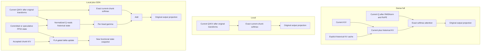
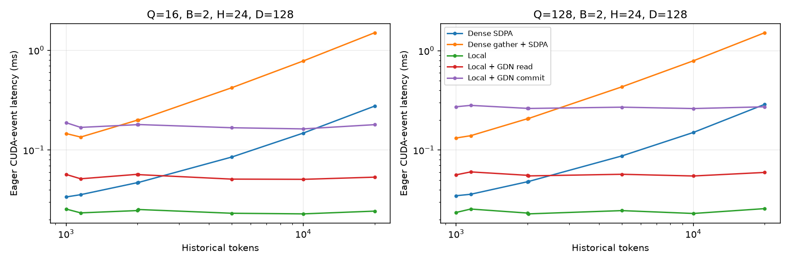
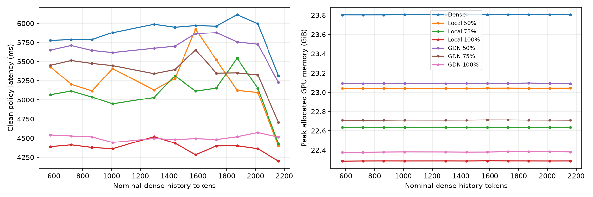
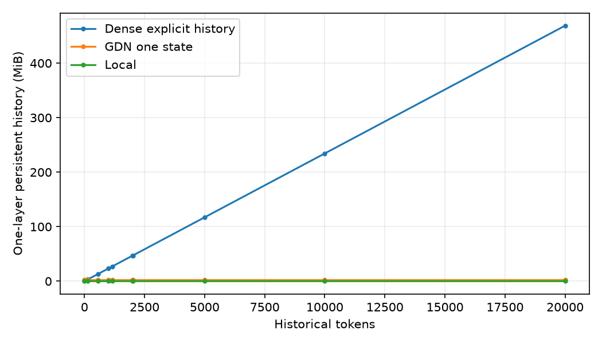
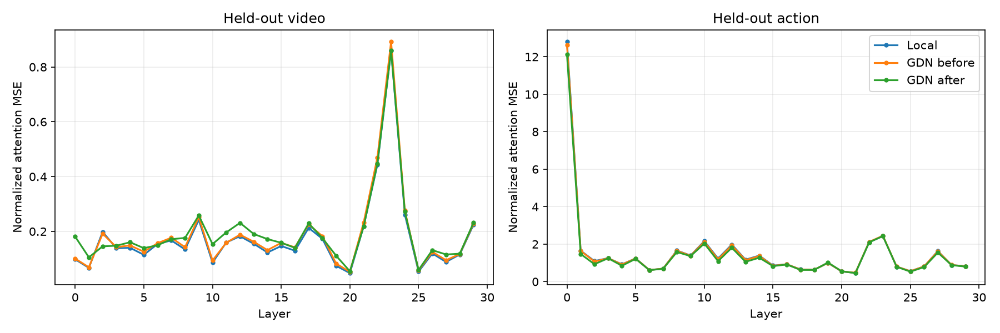

# LingBot-VA hybrid Gated DeltaNet experiment

Work branch: `gdn`. Baseline: `7c6ffa9bfc4b83582cafc860fab4c82cc7deeeeb`.

The minimal hybrid is implemented and benchmarked on an H100. At the configured LIBERO window, GDN 50% gives only a 1.033× policy speedup, GDN 75% gives 1.093×, and GDN 100% gives 1.301×. These are latency results, not evidence of a usable replacement policy. The smoke evaluation and gate-only alignment below assess the quality cost.

## Implementation and scope

The official [LingBot-VA](https://github.com/Robbyant/lingbot-va) posttrained LIBERO-long checkpoint is used without changing its original weights. Checkpoint revision: `0e89d1e753019988aba484e8da2dc0810e264d9f`. The implementation uses the low-level gated delta rule in [FLA](https://github.com/fla-org/flash-linear-attention), pinned to `79d12e8ec0ae72bc7f2189b4244d6532ce8c268c` (0.6.0), rather than FLA's complete language-model layer.

`full` retains the original projections, RMS normalization, RoPE, cache allocation, SDPA and output projection. `local` changes only the keys/values attended to: the current chunk. `local_gdn` retains exact current-chunk softmax and adds a recurrent history read before the unchanged output projection:




The GDN branch has three trainable scalars per head: a decay parameter, a delta-update strength, and output scale gamma. These are constant across tokens in this minimal experiment; this is not a claim to reproduce a fully trained, input-gated DeltaNet. Initial decay is 0.0005/token, beta 0.1 and gamma 0.1. With normalized historical keys, the recurrence is:

```text
S_decay = exp(-softplus(log_decay)) * S
S_next  = S_decay + sigmoid(beta_logit) * k̂ ⊗ (v - k̂ᵀ S_decay)
O       = softmax(Q_current K_currentᵀ / √d) V_current + gamma * q̂ᵀ S_history
```

Only the GDN branch applies additional L2 normalization. Adapter training uses FP32 parameters; inference uses bf16 gate values to match the original mixed-precision path. Recurrent state remains FP32. The original LingBot Q/K RMSNorm and RoPE remain intact. FLA computes FP32 recurrent state. A custom Triton read kernel fuses query normalization, FP32-state matrix multiplication (TF32x3), gamma and local residual. FLA chunk/recurrent kernel timings determine the update choice. The differentiable chunk kernel and PyTorch readout are used for alignment.

## Attention and cache analysis

The checkpoint has 30 Transformer blocks, 24 heads of dimension 128 (hidden width 3072). LIBERO uses batch 2 for CFG, 128 video query tokens and 16 action query tokens per chunk; text context has 512 tokens. A policy call makes 21 video and 51 action Transformer calls, including each final zero-noise cache-writing call. Observation-cache updates make one additional video and one additional action call.

The dense cache reserves `15 * (128 + 16) = 2160` K/V tokens per layer. It grows during early episode steps, then evicts old tokens. Dense `update_cache=0` temporarily inserts noisy current K/V and clears their masks afterward; `1` retains predicted K/V; `2` retains observed K/V. The final predicted video therefore conditions all action denoising calls. Before observations are committed, `clear_pred_cache` discards predicted video/action entries. Episode reset clears all cache state.

A subtle baseline behavior is preserved: when dense cache capacity is exhausted, temporary insertion can evict old entries permanently. `restore_cache` clears the newly allocated masks; it does not restore evicted values. Dense equivalence tests include this case.

GDN maintains functional committed and speculative snapshots. Temporary denoising reads state but never updates it. Final predicted video updates speculative state, which action prediction reads; final predicted action extends that same speculative state. Clearing predictions drops the speculative reference. Observed video and actions then update committed state. Explicit snapshot restoration supports rollback without attempting to invert the delta rule. Episode reset deletes both states.

**Approximation:** a fixed-size exponentially decayed GDN state cannot exactly reproduce the dense cache's hard FIFO expiration. The experiment preserves commit/prediction/reset transactions, but deliberately replaces bounded explicit token history with decayed chronological memory. This difference must be considered when interpreting quality, particularly late in an episode.

Uniform conversion selects 15/30 layers for 50%, 23/30 (76.7%) for 75%, and all 30 for 100%. Every converted GDN layer still has exact bidirectional current-chunk softmax.

Server configuration uses `history_backend="full"|"local"|"local_gdn"` and `history_fraction=0.5|0.75|1.0`; the benchmark's `--variant` flag sets these fields. `gdn_kernel="auto"` selects the measured recurrent inference kernel for chunks up to 128 tokens, `gdn_read_kernel="triton"` selects the fused history read, and `gdn_adapter_path` optionally loads the small aligned gates. With no configuration changes, the released dense path remains the default. Zero-based converted layer indices are `floor((i+0.5)*30/N)` for `i=0..N-1`; the 50% setting therefore converts layers 1,3,…,29.


## Measurement protocol

Experiments run inside the existing Slurm allocation 4474 on worker-3, H100 80GB. The original Day-1 evaluation is retained. A bounded helper pauses only the user's evaluation server/client on the selected GPU, preserves their process/GPU state, runs an isolated experiment, and resumes them in `finally`; an independent watchdog first stops the verified experiment group and then resumes evaluation after a timeout. GPU 0 ran the timing matrix; GPU 1 also ran separate quality smoke tests. Each original evaluation lane resumes when its experiments finish. Reported CUDA allocator peaks belong to the benchmark process; total `nvidia-smi` usage also includes the retained original process and must not be confused with model memory.

Timing uses CUDA events, explicit synchronization and warmup. Actual LIBERO rollout profiling validates shapes, history evolution, call counts and environment behavior. Identical recorded RGB observations are replayed for comparative policy timing; these replay results are latency measurements, not success-rate evaluations. Instrumented calls are reported separately from clean end-to-end samples because thousands of event hooks can perturb runtime.

Synthetic attention kernels use B=2, H=24, D=128, bf16 Q/K/V and Q lengths 16/128. They test actual LIBERO history lengths and 1k/2k/5k/10k/20k histories. Separate results cover bare SDPA, SDPA plus the original-style mask/gather, local attention, local plus GDN read, and local plus GDN read/update. Gate construction and FLA state-update work are inside update timing. Loading an entire history into GDN is not charged on every query: online inference updates state only on accepted chunks. Initial history construction and forward-only read throughput are distinct operations.

## Results

The complete seven-configuration timing matrix is measured below. The dense repeat, operator trace and limits on interpreting small speedups are discussed under Bottlenecks, uncertainty and decision.

| Model | Self-attn ms | Block ms | Video ms | Action ms | Clean policy ms | Peak allocated GiB | Attn speedup | Policy speedup |
|---|---:|---:|---:|---:|---:|---:|---:|---:|
| Dense | 2129.5 | 5458.0 | 1882.3 | 4136.3 | 5866.1 | 23.805 | 1.000× | 1.000× |
| Local 50% | 1651.8 | 4768.9 | 1644.4 | 3647.8 | 5239.1 | 23.043 | 1.289× | 1.120× |
| Local 75% | 1494.1 | 4594.9 | 1609.8 | 3517.4 | 5082.1 | 22.636 | 1.425× | 1.154× |
| Local 100% | 813.0 | 4086.8 | 1324.3 | 3327.9 | 4374.9 | 22.289 | 2.619× | 1.341× |
| GDN 50% | 1889.9 | 5086.7 | 1798.7 | 3838.2 | 5678.2 | 23.095 | 1.127× | 1.033× |
| GDN 75% | 1717.1 | 4893.5 | 1743.6 | 3698.7 | 5365.0 | 22.713 | 1.240× | 1.093× |
| GDN 100% | 1053.4 | 4326.2 | 1472.4 | 3421.5 | 4507.3 | 22.383 | 2.021× | 1.301× |

Self-attention and block columns sum all 30 layers across all 72 denoising calls. Video/action spans include intervening scheduler/host dispatch between Transformer calls. These four columns use instrumented calls; clean policy times use separate calls without profiler hooks. Their totals need not equal clean policy latency. All times are milliseconds.

| Model | Persistent cache peak MiB | Cache saving | Observed cache-update ms | Policy calls/s | Action-equivalent Hz (with commit) | Full cycle ms | Full cycle speedup | Peak reserved GiB |
|---|---:|---:|---:|---:|---:|---:|---:|---:|
| Dense | 1519.4 | 0.0% | 232.9 | 0.170 | 2.623 | 6099.0 | 1.000× | 23.865 |
| Local 50% | 759.7 | 50.0% | 224.5 | 0.191 | 2.928 | 5463.6 | 1.116× | 23.104 |
| Local 75% | 354.5 | 76.7% | 271.7 | 0.197 | 2.989 | 5353.8 | 1.139× | 22.697 |
| Local 100% | 0.0 | 100.0% | 217.7 | 0.229 | 3.484 | 4592.5 | 1.328× | 22.359 |
| GDN 50% | 849.7 | 44.1% | 245.8 | 0.176 | 2.701 | 5924.0 | 1.030× | 23.361 |
| GDN 75% | 492.5 | 67.6% | 238.7 | 0.186 | 2.855 | 5603.6 | 1.088× | 23.346 |
| GDN 100% | 180.0 | 88.2% | 242.9 | 0.222 | 3.368 | 4750.2 | 1.284× | 23.109 |

Persistent GDN cache peak includes committed **and** speculative states. Allocator peak also includes transient state-update/output tensors. Hz excludes simulator, transport, model load and reset. The policy emits 16 actions per steady-state call; action-equivalent Hz is not a sensor feedback rate.

| Model | Clean samples | Clean policy mean ± SD ms | Instrumented policy mean ms | Cross-attn ms | FFN ms | Mean one-block invocation ms |
|---|---:|---:|---:|---:|---:|---:|
| Dense | 11 | 5866.1 ± 211.0 | 6032.8 | 645.6 | 277.6 | 2.527 |
| Local 50% | 11 | 5239.1 ± 372.0 | 5307.9 | 599.5 | 247.1 | 2.208 |
| Local 75% | 11 | 5082.1 ± 270.7 | 5140.6 | 584.0 | 243.4 | 2.127 |
| Local 100% | 11 | 4374.9 ± 81.6 | 4664.6 | 603.8 | 265.2 | 1.892 |
| GDN 50% | 11 | 5678.2 ± 171.6 | 5759.5 | 626.8 | 264.9 | 2.355 |
| GDN 75% | 11 | 5365.0 ± 239.0 | 5455.3 | 617.1 | 260.9 | 2.266 |
| GDN 100% | 11 | 4507.3 ± 34.6 | 4906.2 | 634.7 | 279.9 | 2.003 |

### Synthetic eager attention (ms)

| Query tokens | Historical tokens | Dense SDPA | Dense gather + SDPA | Local | Local + GDN read | Local + GDN read/update |
|---:|---:|---:|---:|---:|---:|---:|
| 16 | 1000 | 0.0339 | 0.1464 | 0.0257 | 0.0570 | 0.1881 |
| 16 | 2000 | 0.0472 | 0.1996 | 0.0248 | 0.0571 | 0.1797 |
| 16 | 5000 | 0.0852 | 0.4217 | 0.0233 | 0.0512 | 0.1674 |
| 16 | 10000 | 0.1480 | 0.7813 | 0.0229 | 0.0509 | 0.1630 |
| 16 | 20000 | 0.2758 | 1.4987 | 0.0244 | 0.0535 | 0.1797 |
| 128 | 1000 | 0.0347 | 0.1322 | 0.0236 | 0.0564 | 0.2727 |
| 128 | 2000 | 0.0480 | 0.2069 | 0.0232 | 0.0557 | 0.2626 |
| 128 | 5000 | 0.0873 | 0.4325 | 0.0246 | 0.0571 | 0.2700 |
| 128 | 10000 | 0.1503 | 0.7901 | 0.0230 | 0.0549 | 0.2616 |
| 128 | 20000 | 0.2884 | 1.5143 | 0.0258 | 0.0596 | 0.2724 |

These CUDA-event intervals include eager Python launch gaps, as deployment does. They are not CUDA-graph-only hardware throughput. History construction is excluded from repeated reads; commit measurements include gate materialization and FLA recurrence.

| Query tokens | Update/read kernel | ms |
|---:|---|---:|
| 16 | chunk | 0.7659 |
| 16 | recurrent | 0.1476 |
| 16 | read_torch | 0.0803 |
| 16 | read_triton | 0.0295 |
| 128 | chunk | 0.5655 |
| 128 | recurrent | 0.2120 |
| 128 | read_torch | 0.0774 |
| 128 | read_triton | 0.0329 |

### Actual dense LIBERO history

| Chunk | Video history before | Action history before | Profiled policy ms | Self-attn ms | Cross-attn ms | FFN ms | Block ms |
|---:|---:|---:|---:|---:|---:|---:|---:|
| 0 | 0 | 128 | 8312.4 | 2714.5 | 1558.4 | 357.1 | 7257.0 |
| 3 | 432 | 560 | 6395.9 | 2399.1 | 672.6 | 295.4 | 5788.1 |
| 8 | 1152 | 1280 | 6331.0 | 2467.5 | 657.0 | 278.8 | 5755.4 |
| 15 | 2160 | 2160 | 6661.7 | 2431.7 | 721.5 | 331.4 | 6034.9 |

Chunk 0 is cold and excluded from steady-state conclusions. This first actual rollout used an earlier, heavier profiler (including nested SDPA events); its absolute times are not the clean comparative timings above.

### LIBERO smoke checks

| Model | Adaptation | Task | Initial state | Success | Episode seconds |
|---|---|---:|---:|---|---:|
| dense_libero_profile | none | 0 | 0 | True | 169.2 |
| smoke_dense_before | none | 0 | 0 | True | 158.9 |
| smoke_dense_before | none | 5 | 0 | True | 83.9 |
| smoke_gdn100_after | after | 0 | 0 | False | 363.8 |
| smoke_gdn100_after | after | 5 | 0 | False | 329.5 |
| smoke_gdn100_before | none | 0 | 0 | False | 338.9 |
| smoke_gdn100_before | none | 5 | 0 | False | 309.2 |
| smoke_gdn50_after | after | 0 | 0 | False | 392.0 |
| smoke_gdn50_after | after | 5 | 0 | False | 366.5 |
| smoke_gdn50_before | none | 0 | 0 | False | 399.5 |
| smoke_gdn50_before | none | 5 | 0 | False | 356.4 |
| smoke_gdn75_after | after | 0 | 0 | False | 388.7 |
| smoke_gdn75_after | after | 5 | 0 | False | 345.7 |
| smoke_gdn75_before | none | 0 | 0 | False | 384.8 |
| smoke_gdn75_before | none | 5 | 0 | False | 345.5 |
| smoke_local100_before | none | 0 | 0 | False | 344.5 |
| smoke_local100_matched | none | 5 | 0 | False | 300.3 |

### Teacher-forced attention alignment

| Split | Local NMSE | GDN before NMSE | GDN after NMSE |
|---|---:|---:|---:|
| train chunks 1/5/10 | 0.82823 | 0.82510 | 0.79191 |
| held-out chunk 14 | 0.86169 | 0.85895 | 0.83497 |

| Held-out phase | Local NMSE | GDN before NMSE | GDN after NMSE |
|---|---:|---:|---:|
| video | 0.17761 | 0.18598 | 0.19678 |
| action | 1.54577 | 1.53192 | 1.47316 |

Alignment: 36 Adam steps/layer, learning rate 0.025, 2160 trainable parameters, 48.7 s including setup/evaluation. No original checkpoint weights were loaded into the optimizer process.

The timing matrix uses initial, unadapted GDN gates; the aligned adapter is assessed separately in the quality smoke tests.



The read-only dense-SDPA/GDN crossover is bracketed between the measured 2k and 5k points for both query lengths. Including original-style mask/gather changes that comparison: local+GDN is already faster than gather+SDPA at 1k. Commit overhead is shown separately and is included in the real policy/cache timings. Synthetic tensors are reused after warmup; these curves are not an end-to-end long-context policy measurement.



The x axis is the nominal dense history `min(chunk_index * 144, 2160)`, used to align identical replay positions across variants. Actual active masks can differ near saturation because current-token insertion evicts entries; per-call measured histories are in the compact profile records. GDN instead retains a decayed recurrent summary. Dense reserves its entire 2160-token cache from reset, so actual allocated cache memory does not grow with active history.



This synthetic plot counts allocated history tensor bytes per layer at each tested length, excluding model weights/current-query temporaries. It illustrates capacity scaling; LIBERO's configured dense window remains 2160 tokens.



## Minimal alignment and LIBERO checks

The unchanged dense control succeeded on **2/2** matched episodes (tasks 0 and 5, initial state 0). Every GDN variant succeeded on **0/2 before alignment and 0/2 after alignment**. These individual outcomes detect catastrophic degradation; they do not estimate final LIBERO-long success rate. Local-50/75 receive latency ablations only; no quality result is claimed for those settings. The Local-100 matched outcomes appear in the per-episode table.

| Configuration | Before alignment | After 36-step gate alignment |
|---|---:|---:|
| Dense | 2/2 successful episodes | Not applicable |
| Local 100% | 0/2 | No GDN parameters |
| GDN 50% | 0/2 | 0/2 |
| GDN 75% | 0/2 | 0/2 |
| GDN 100% | 0/2 | 0/2 |

Teacher captures contain post-RoPE Q/K/V and dense attention outputs from fixed RGB replay. Only 2,160 total adapter parameters (30 × 24 × 3) are optimized. The alignment process does not even load original model weights, preventing unintended base-model training. The normalized attention-output MSE is `mean((student-teacher)^2) / (mean(teacher^2)+1e-8)`. Training uses chunks 1/5/10, with chunk 14 held out, and both video/action targets. This is teacher-forced attention alignment, not full-policy distillation or a final policy success-rate experiment.

## Correctness and tests

Final H100 verification: 18 tests passed in 12.46 seconds (two upstream TileLang deprecation warnings); the output is retained in [gdn_data/tests_h100.txt](gdn_data/tests_h100.txt). Tests cover dense equivalence to the official base commit including eviction, uniform layer counts, no temporary history mutation, predicted-video conditioning of actions, prediction rollback, explicit snapshots, independent cache names, episode reset, rejection of ambiguous observed commits, FLA state equivalence to an independent FP32 recurrence, unchanged FLA input state, and fused read equivalence to FP32 PyTorch.

## Bottlenecks, uncertainty and decision

The final matrix uses 18 chunks, discards the first three, profiles chunks 3/8/15/17, and reports the remaining 11 calls without event hooks. Standard deviations are variation across history positions, not confidence intervals from independent trials. A second dense run measured 6148.6 ± 255.0 ms over the **same 11 chunk indices**, versus 5866.1 ± 211.0 ms in the matrix: 4.8% run-to-run drift. Thus the GDN-50 gain of 3.3% is not persuasive; the 9.3% GDN-75 gain is modest and needs interleaved repetitions. The much larger GDN-100 and Local-100 differences survive this sanity check. Dense-containing variants also become faster near cache saturation; the history curves are nonmonotonic, and these measurements do not establish which kernel/cache transition causes it.

The mean instrumented dense policy interval is 6032.8 ms: self-attention is 35.3%, text cross-attention 10.7%, FFN 4.6%, and full Transformer blocks 90.5%. The self-attention interval includes Q/K/V projections, normalization, RoPE, cache bookkeeping, SDPA and output projection. **It is not the fraction spent solely multiplying historical attention.** Removing all history lowers clean policy time by 25.4%; this ablation measures the whole history path and also changes policy behavior.

A separate PyTorch operator trace after the repeated dense replay recorded 2160 self-SDPA calls with 73.25 ms of associated device kernels, and 2160 cross-SDPA calls with 24.19 ms. It also recorded 6704 `aten::nonzero` calls, 6652 `aten::index` calls (303.92 ms self device time), and 15591 `cudaStreamSynchronize` calls. These are whole-policy diagnostic counts, not a cache-only attribution or a second clean latency benchmark. CPU and CUDA times overlap and must not be added. Device annotations also appear in the trace, so the stored sum of device events is not a GPU-utilization measure. The original cache uses CUDA masks, dynamic indexing and scalar decisions; CUDA `nonzero` requires a host-device synchronization according to [PyTorch documentation](https://docs.pytorch.org/docs/2.9/generated/torch.nonzero.html). The evidence points to substantial cache/dispatch overhead rather than expensive softmax arithmetic at these small query shapes.

| Question | Measured answer / decision |
|---|---|
| How much runtime is historical full attention? | Full self-attention module: 35.3% of instrumented policy. Removing the complete history path saves 25.4% of clean policy latency. Pure historical SDPA arithmetic was not independently isolated. |
| Where does GDN become faster? | Read-only local+GDN crosses bare dense SDPA between 2k and 5k sampled historical tokens; with original-style gathering it is already faster at 1k. LIBERO caps dense history at 2160 tokens. Update costs remain material. |
| Are 50% / 75% useful? | 1.033× / 1.093× policy speedups before adaptation. The 50% difference is smaller than baseline drift. Neither is a demonstrated usable policy replacement. |
| Is 100% worthwhile? | 1.301× generation speedup, 1.284× including observed commits, but Local-100 is faster still (1.341× generation). GDN memory has not yet recovered task behavior in the smoke checks. |
| How much memory is removed? | Persistent history drops from 1519.4 MiB to 849.7 / 492.5 / 180.0 MiB for GDN 50/75/100. Total peak allocated VRAM at 100% falls only 6.0% (23.805 → 22.383 GiB), because model weights dominate. |
| Does minimal alignment help? | Held-out mean attention NMSE improves 0.85895 → 0.83497 (2.8%). Video error worsens; action error remains 1.47316. This small teacher-forced optimization does not establish policy recovery. |
| Primary value? | A fixed-state memory/long-context research result and a measurable high-conversion latency reduction; not currently a quality-preserving LIBERO acceleration. No full-policy 20k-token claim is supported. |

The additive architecture also has a structural limitation: dense softmax jointly normalizes current and historical keys, whereas the local branch is normalized over current keys alone and is added at unit strength. A per-head history scale does not directly recover that query-dependent normalization. This is a plausible contributor to the large attention error, not a causal claim established by this smoke test.

**Recommended next experiment:** optimize dense cache mask/scalar/index handling while preserving its exact insertion, eviction and rollback semantics; rerun bitwise cache tests and interleaved dense timings. This targets measured overhead without requiring policy adaptation. For further GDN research, first improve a limited converted-layer model's alignment on both modalities and multiple denoising levels, then include student-generated histories. The present constant per-head gates, 36-step fit and clean-final-call teacher captures are deliberately minimal; their failure is not evidence that all trained GDN hybrids must fail. Do not scale training or claim a final success rate from these two tasks.

## Files changed

- `wan_va/modules/model.py`: selectable self-attention branch, cache dispatch, optional teacher capture, optional FlashAttention import.
- `wan_va/modules/history_attention.py`: minimal adapters, snapshot transactions, layer configuration and memory accounting.
- `wan_va/modules/history_kernels.py`: fused Triton historical readout.
- `wan_va/wan_va_server.py`: configure backend after official weight loading, before FSDP.
- `wan_va/distributed/fsdp.py`: optional ignored gate parameters for the validated replicated-gate optimization.
- `evaluation/libero/client.py`: standard-library JSON writer removes an unrelated LeRobot import dependency in evaluation.
- `tests/gdn/test_history_attention.py`: state, numerical, gradient and nested FSDP checks.
- `tests/gdn/test_isolated.py`: orphan recovery and PID-reuse protection tests.
- `benchmarks/gdn/`: isolated experiment runner, actual LIBERO profile, recorded replay, synthetic kernels, frozen teacher capture, adapter-only alignment, result analysis.
- `docs/gdn_data/`, `docs/gdn_figures/`: measured small artifacts and plots; large captures and checkpoint assets remain outside Git.

## Reproduction

Run these commands from the repository root in the activated H100 environment. No large-scale training is involved.

### Existing H100 environment

From the laptop:

```bash
ssh -i /Users/hoanganh692004/.ssh/id_ed25519_vinmotion anhdh35@10.254.152.73
srun --jobid=4474 --overlap -n1 --pty bash
cd /mnt/data/vmo-ai-task/anhdh35/lingbot-va
git switch gdn
source .eval_setup/env.sh
```

The active allocation and process ports are session-specific. On a new allocation, replace job ID 4474 and use its assigned GPU(s). `.eval_setup/env.sh` is the existing Day-1 environment activation script; it selects `.venv-libero-eval`, the local LIBERO checkout/config, and OSMesa libraries. The full installed package manifest is recorded in `docs/gdn_data/environment.txt`. Key versions are Python 3.10.16, PyTorch 2.9.0+cu126, diffusers 0.36.0, transformers 4.55.2, NumPy 1.26.4, robosuite 1.4.0 and MuJoCo 2.3.7. The benchmark uses LIBERO's `libero_10` suite (LIBERO-long), its official assets and initial states. Offline inference does not read demonstration HDF5 datasets.

FLA installation used:

```bash
git clone https://github.com/fla-org/flash-linear-attention.git third_party/flash-linear-attention
git -C third_party/flash-linear-attention checkout 79d12e8ec0ae72bc7f2189b4244d6532ce8c268c
uv pip install --python .venv-libero-eval/bin/python --no-deps -e third_party/flash-linear-attention
uv pip install --python .venv-libero-eval/bin/python tilelang==0.1.14
```

The official checkpoint is already downloaded at `checkpoints/lingbot-va-posttrain-libero-long`. For a fresh download into that location:

```bash
HF_HUB_OFFLINE=0 python - <<'PY'
from huggingface_hub import snapshot_download
snapshot_download('robbyant/lingbot-va-posttrain-libero-long',
                  revision='0e89d1e753019988aba484e8da2dc0810e264d9f',
                  local_dir='checkpoints/lingbot-va-posttrain-libero-long')
PY
```

The official server explicitly requests the PyTorch SDPA attention backend. No FlashAttention package is required for these commands.

The activation script used for the existing workspace is equivalent to the following (adjust the root and renderer library path for another machine):

```bash
export LINGBOT_EVAL_ROOT="$PWD"
export PATH="$LINGBOT_EVAL_ROOT/.venv-libero-eval/bin:$PATH"
export PYTHONPATH="$LINGBOT_EVAL_ROOT:$LINGBOT_EVAL_ROOT/third_party/LIBERO"
export LIBERO_CONFIG_PATH="$LINGBOT_EVAL_ROOT/.eval_setup/libero_config"
export LD_LIBRARY_PATH="$LINGBOT_EVAL_ROOT/.eval_setup/system-libs/usr/lib/x86_64-linux-gnu:${LD_LIBRARY_PATH:-}"
export MUJOCO_GL=osmesa PYOPENGL_PLATFORM=osmesa
export TORCH_FORCE_NO_WEIGHTS_ONLY_LOAD=1 HF_HUB_OFFLINE=1 TOKENIZERS_PARALLELISM=false
export OMP_NUM_THREADS=8 MKL_NUM_THREADS=8 OPENBLAS_NUM_THREADS=8 NUMBA_NUM_THREADS=8 LP_NUM_THREADS=8
export EVAL_SEED=0 PYTHONUNBUFFERED=1
```

OSMesa libraries and a LIBERO configuration pointing to the pinned checkout must already be installed. The original setup/asset validation is recorded in [the Day-1 evaluation report](../eval_reports/libero_long_h100_20260928/EVAL_LIBERO_LONG.md). The trusted-checkpoint loading flag is needed for LIBERO's pinned legacy initial-state files. This environment is specific to the existing H100 workspace; the commands do not silently download or configure simulator assets.


### Correctness, profiling, synthetic kernels and timing matrix

Use GPU 0 / original server port 30056; GPU 1 / port 30057 is an equivalent isolated lane. `isolated.py` resumes only matching owned evaluation processes, and kills only its own experiment process group on timeout. On a fresh allocation without a matching evaluation server, it simply runs the command on the selected GPU.

```bash
python benchmarks/gdn/isolated.py --gpu 0 --port 30056 --timeout 900 \
  --log docs/gdn_data/tests.log -- python -m pytest -q tests/gdn

python benchmarks/gdn/isolated.py --gpu 0 --port 30056 --timeout 1200 \
  --log docs/gdn_data/dense_profile.log -- \
  torchrun --standalone --nnodes=1 --nproc_per_node=1 benchmarks/gdn/libero_profile.py \
  --variant dense --tasks 0 --episodes 1 --profile --out docs/gdn_data/dense_libero_profile

python benchmarks/gdn/isolated.py --gpu 0 --port 30056 --timeout 600 \
  --log docs/gdn_data/synthetic_final.log -- \
  python benchmarks/gdn/synthetic.py --out docs/gdn_data/synthetic_final

export GDN_RECORDING='outputs/libero_long_20260928T211222Z_seed0/smoke_visualization/real/put both the alphabet soup and the tomato sauce in the basket_20260928_211326'
GDN_GPU=0 GDN_PORT=30056 bash benchmarks/gdn/run_matrix.sh
```

The recording consists of `obs_data_*.pt` emitted by the unmodified dense server during its successful Day-1 smoke rollout. A newly generated dense rollout also writes these under the chosen output directory's `debug/real/<prompt_timestamp>/`; set `GDN_RECORDING` to that directory to generate a new comparison dataset. Keep the same directory across all variants. Re-running a benchmark overwrites its named metrics; use a different `--out` to retain multiple repetitions.

For operator-level diagnostics, add `--operators` to a replay command; it runs an additional PyTorch profiler pass **after** the timed samples. For FLA update/read controls, use `--kernel chunk`, `--kernel recurrent`, or `--read-kernel torch`. `--replicated-gates` explicitly selects the validated default: tiny frozen gates are replicated in bf16 compute dtype, while original parameters retain FSDP. `--shard-gates` selects the control with gates included in FSDP. Exact output/state equivalence passed through the nested production wrapper. A short five-sample comparison measured 4610.3 ms with sharded gates versus 4276.2 ms with replicated gates; the final matrix uses the latter.

### Frozen teacher capture and minimal alignment

```bash
python benchmarks/gdn/isolated.py --gpu 0 --port 30056 --timeout 900 \
  --log docs/gdn_data/capture.log -- \
  torchrun --standalone --nnodes=1 --nproc_per_node=1 benchmarks/gdn/capture.py \
  --variant dense --recording "$GDN_RECORDING" --out outputs/gdn_capture

python benchmarks/gdn/isolated.py --gpu 0 --port 30056 --timeout 1200 \
  --log docs/gdn_data/align.log -- \
  python benchmarks/gdn/align.py --capture outputs/gdn_capture \
  --steps 36 --lr 0.025 --out docs/gdn_data/alignment
```

Large teacher captures and RGB recordings stay in `outputs/`; only adapter weights and compact metrics belong in the branch.

### LIBERO smoke evaluation before and after alignment

```bash
for variant in dense local100 gdn50 gdn75 gdn100; do
  python benchmarks/gdn/isolated.py --gpu 1 --port 30057 --timeout 1500 \
    --log "docs/gdn_data/smoke_${variant}_before.log" -- \
    torchrun --standalone --nnodes=1 --nproc_per_node=1 benchmarks/gdn/libero_profile.py \
    --variant "$variant" --tasks 0 5 --episodes 1 \
    --out "docs/gdn_data/smoke_${variant}_before"
done

for variant in gdn50 gdn75 gdn100; do
  python benchmarks/gdn/isolated.py --gpu 1 --port 30057 --timeout 1500 \
    --log "docs/gdn_data/smoke_${variant}_after.log" -- \
    torchrun --standalone --nnodes=1 --nproc_per_node=1 benchmarks/gdn/libero_profile.py \
    --variant "$variant" --tasks 0 5 --episodes 1 \
    --adapter docs/gdn_data/alignment/adapter.pt \
    --out "docs/gdn_data/smoke_${variant}_after"
done
```

The first Local-100 run predates the per-episode RNG restoration. Its task-0 result is comparable because that was the first episode. Task 5 is superseded by this matched rerun (the current loop above already applies restoration):

```bash
python benchmarks/gdn/isolated.py --gpu 0 --port 30056 --timeout 900 \
  --log docs/gdn_data/smoke_local100_matched.log -- \
  torchrun --standalone --nnodes=1 --nproc_per_node=1 benchmarks/gdn/libero_profile.py \
  --variant local100 --tasks 5 --episodes 1 --out docs/gdn_data/smoke_local100_matched
```

Each task uses initial state 0, environment seed 0 and the full original 800-step limit. The final harness restores the post-model-load torch RNG state before each episode, so a previous task's termination time cannot change the next task's initial denoising noise. Episode reset still goes through the original server reset path.

### Tables and plots

```bash
python benchmarks/gdn/compact.py --root docs/gdn_data
python benchmarks/gdn/analyze.py --data docs/gdn_data --figures docs/gdn_figures --suffix _final
```

Analysis requires NumPy and matplotlib. Compact JSON preserves call metadata and sums CUDA-event durations by module, phase and cache-update flag; the original individual-event JSONL stays on the server for audit.

## Review and recovery follow-up

An independent code review found no confirmed core attention/cache defect, but identified a watchdog recovery flaw and incomplete benchmark source hashing. Both were addressed locally: the watchdog now stops a verified experiment process group before resuming evaluation, and a launch handshake prevents GPU execution until process ownership is recorded atomically. A real-subprocess regression test failed on the old resume-before-stop behavior, then passed after the change. Code manifests now include the server, FSDP wrappers, evaluation client and every benchmark Python script. These changes have been synchronized to the H100 repository and the expanded suite passed there.

Fresh local verification with PyTorch 2.9.0: 9 tests passed (7 attention/state and 2 process-recovery tests), 9 CUDA tests skipped. The bare repository-wide `pytest -q` command fails during collection of unrelated `evaluation/robotwin/test_render.py` because `sapien` is not installed in this local environment. The final repeat passed 9 CPU tests with 9 CUDA skips in the established Python 3.12 environment. An attempted fresh default-Python 3.14 environment crashed before test collection, and an incomplete temporary Python 3.12 environment lacked Diffusers; neither was used for measurements. The focused GDN suite result is saved in `docs/gdn_data/tests_local.txt`. The expanded H100 suite subsequently passed all 18 tests, including the nested production FSDP wrapper. Replicated gates subsequently measured faster in the short control and are enabled by default for GDN. Dense behavior is unchanged.

The installed Triton 3.5.0 falls within FLA's guarded Hopper backward range (>=3.4.0,<3.7.1). The initial alignment failed explicitly at `chunk_bwd_dqkwg`; it did not silently train with that kernel. TileLang dispatch resolves the blocked backward path, and gate gradients were checked against an independent recurrence. See [upstream FLA issue 640](https://github.com/fla-org/flash-linear-attention/issues/640).

### Gate-control and repeat-baseline commands

```bash
for setting in shard replicated; do
  python benchmarks/gdn/isolated.py --gpu 0 --port 30056 --timeout 500 \
    --log "docs/gdn_data/gates_${setting}.log" -- \
    torchrun --standalone --nnodes=1 --nproc_per_node=1 benchmarks/gdn/replay.py \
    --variant gdn100 --chunks 8 --warmup 3 --"${setting}-gates" \
    --recording "$GDN_RECORDING" --out "docs/gdn_data/gates_${setting}"
done

python benchmarks/gdn/isolated.py --gpu 0 --port 30056 --timeout 700 \
  --log docs/gdn_data/replay_dense_repeat.log -- \
  torchrun --standalone --nnodes=1 --nproc_per_node=1 benchmarks/gdn/replay.py \
  --variant dense --chunks 18 --warmup 3 --operators \
  --recording "$GDN_RECORDING" --out docs/gdn_data/replay_dense_repeat
```

The eight-chunk gate control also provides a full-model equivalence check. All 8 saved action tensors and all 8 saved video-latent tensors were bitwise equal between the two settings. To reproduce that check:

```bash
python - <<'PY'
from pathlib import Path
import torch
root = Path('docs/gdn_data')
a = next((root/'gates_shard/debug/real').iterdir())
b = next((root/'gates_replicated/debug/real').iterdir())
count = 0
for pattern in ('actions_*.pt', 'latents_*.pt'):
    for f in sorted(a.glob(pattern)):
        x = torch.as_tensor(torch.load(f, map_location='cpu', weights_only=False))
        y = torch.as_tensor(torch.load(b/f.name, map_location='cpu', weights_only=False))
        assert torch.equal(x, y), f.name
        count += 1
assert count == 16
print('16 tensors bitwise equal')
PY
```

LIBERO checkout revision used: `8f1084e3132a39270c3a13ebe37270a43ece2a01`. The complete runtime provenance and source-file hashes are retained with the measured artifacts.

## Original evaluation status after the experiment

Both original Day-1 evaluation servers and clients were verified resumed after the last experiment. At 2026-09-29 04:16:07 UTC, that separate run had completed 315/500 episodes with 301 successes and remained in progress. This partial count is not a final LIBERO-long success rate and is not combined with the GDN smoke episodes. The allocation and original output directory remain intact.
